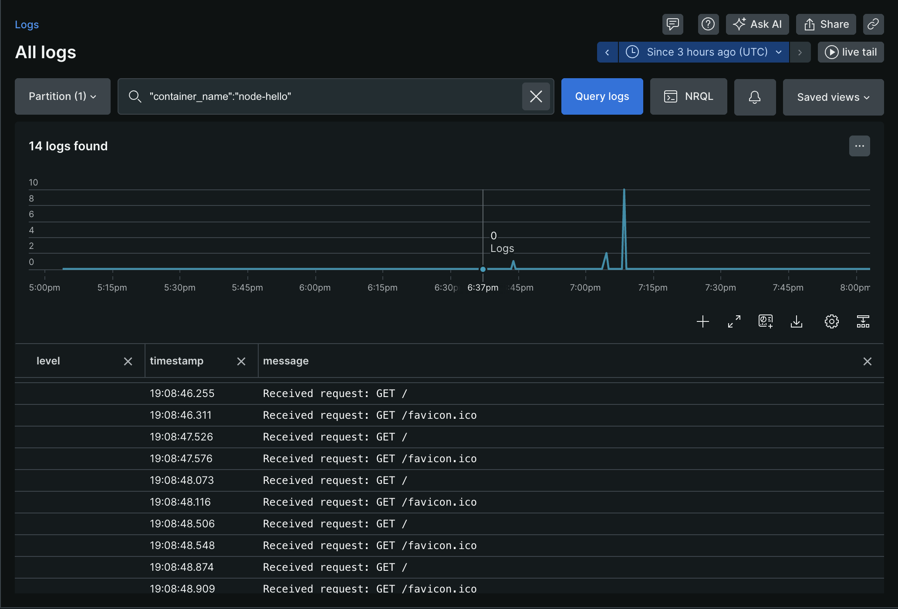
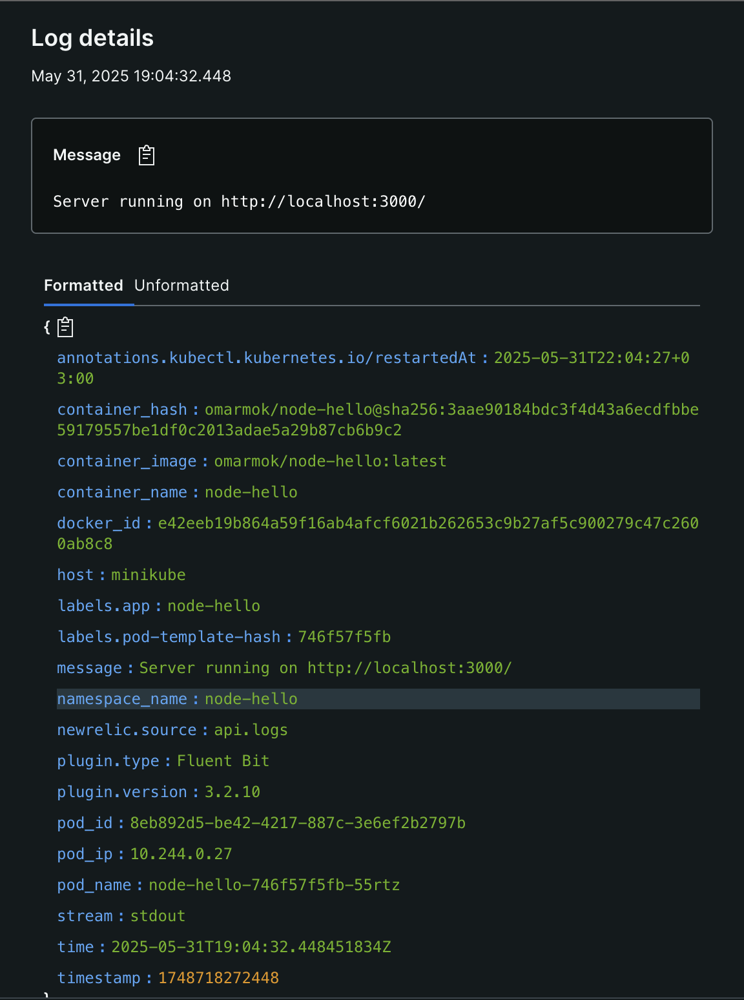

# Nawy DevOps Task

This repository contains a DevOps task for Nawy, focusing on containerization, infrastructure as code, and continuous integration/continuous deployment (CI/CD) practices.

## Project Structure

```
nawy-devops-task/
├── .github/workflows/         # CI/CD workflows using GitHub Actions
│   ├── docker-build.yaml
│   └── lint.yaml
├── node-hello/                # Node.js Hello World application
│   ├── .prettierrc
│   ├── eslint.config.mjs
│   ├── index.js
│   ├── package.json
│   ├── package-lock.json
│   └── README.md
├── ops/                       # Infrastructure & monitoring setup
│   ├── monitoring/
│   │   └── fluentbit.yml      # Log forwarding config
│   └── terraform/             # Terraform IaC files
│       ├── main.tf
│       ├── provider.tf
│       └── variables.tf
├── .dockerignore              # Docker ignore rules
├── Dockerfile                 # Dockerfile to build the Node.js app
└── README.md                  # Project documentation
```

## Features

- **Node.js Application**: A simple "Hello World" application located in the `node-hello` directory.
- **Dockerization**: The application is containerized using Docker, with a `Dockerfile` provided for building the image.
- **Infrastructure as Code**: The `ops` directory contains configurations for setting up infrastructure, potentially using tools like Terraform.
- **CI/CD Pipeline**: Automated workflows are set up using GitHub Actions, located in the `.github/workflows` directory.

## Getting Started

### Prerequisites

- Docker installed on your machine
- Terraform installed if using the IaC configurations
- Minikube (kubectl), you can check the official [docs](https://minikube.sigs.k8s.io/docs/start/?arch=%2Fmacos%2Farm64%2Fstable%2Fbinary+download) 

### Building and Running the Application

1. Build the Docker image:

   ```bash
   docker build -t nawy-node-hello .
   ```

2. Run the Docker container:

   ```bash
   docker run -p 3000:3000 nawy-node-hello
   ```

4. Access the application at `http://localhost:3000`.

### Infrastructure Deployment

We are deploying to kubernetes, so it necessary to have Kubernetes installed and working

*Note: that the local cluster should be able to connect to the internet.*
you can run this command: ```minikube start --network=bridge```

If using Terraform for infrastructure deployment:

1. Navigate to the `ops/terraform` directory:

   ```bash
   cd ops/terraform
   ```

2. Initialize Terraform:

   ```bash
   terraform init
   ```

3. Review the execution plan:

   ```bash
   terraform plan
   ```

4. Apply the configuration:

   ```bash
   terraform apply
   ```

### Logging

1. Navigate to the `ops/monitoring` directory:

   ```bash
   cd ops/monitoring
   ```

2. Apply the manifest file to deploy the FluentBit daemonset:

   ```bash
   kubectl apply -f fluentbit.yml --namespace=logging --context=minikube
   ```

## CI/CD Workflow

GitHub Actions workflows are defined to automate the build and deployment process:

- On push to the `main` branch:
  - Build the Docker image
  - Login to Docker Registry and Push the image

- On PR creation to the `main` branch:
  - Setup NodeJs
  - Cache the `~/.npm` file for future runs
  - Install the Project dependencies
  - Run ESlint based on the `eslint.config.mjs` configs

## New relic Logs



